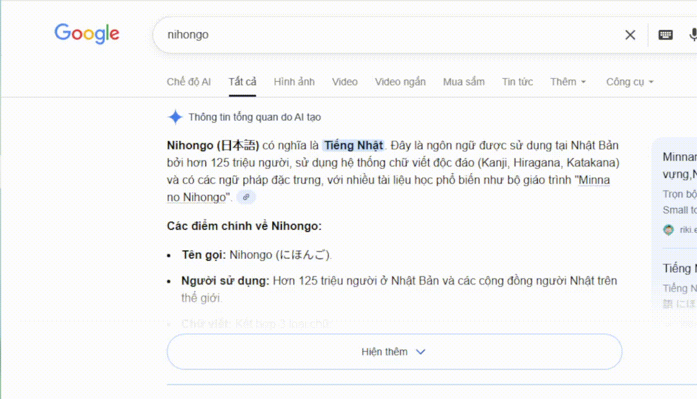

  
  <h1>PopupDict</h1>
  
<b>Japanese to Vietnamese Dictionary Extension</b>

  
<i>A Chrome extension for Japanese-Vietnamese word lookup and translation.</i>

  

---

## 🚀 Features
- **Japanese Selection Popup**: Automatically detects Japanese text selection and shows a popup.
- **Dictionary Lookup**: Get word's definition accurately.
- **Kanji Mode**: Look up Kanji details including Kunyomi, Onyomi, and Han-Viet.
- **Translation**: Uses Google Translate API for sentence translation.
- **Text-to-Speech**: Listen to the pronunciation of selected text in Japanese.
- **Soft Brutalism UI**: A bold, high-contrast, and modern design.

## 🛠 Installation
1. Download or clone this repository.
2. Open Chrome and navigate to `chrome://extensions/`.
3. Enable **"Developer mode"** in the top right corner.
4. Click **"Load unpacked"** and select the folder containing this extension.

